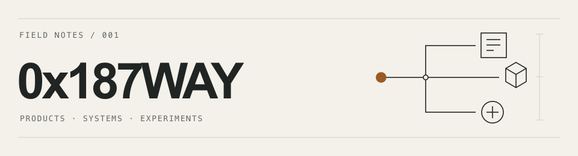

<picture>
  <source media="(prefers-color-scheme: dark)" srcset="assets/lab-banner-dark.png">
  <source media="(prefers-color-scheme: light)" srcset="assets/lab-banner-light.png">
  
</picture>

# 0x187WAY · Product builder

I build tools that turn messy information into clearer decisions.

My background is in crypto, fintech, and partnerships. Today I'm building workflow tools and experimenting with AI and spatial interfaces.

**Strange inputs. Useful systems.**

## Selected work

### 01 — Rill

**What does your software stack cost, and what renews next?**

Rill explores a clearer way for founders to review recurring software costs, renewal dates, and subscription records extracted from documents.

One design choice: AI suggests extracted information, deterministic code handles money calculations, and a person confirms the record.

Product prototype · [Try the fictional demo](https://rill-founder-spend-os.way777.chatgpt.site/demo) · [Design and implementation notes](case-studies/rill.md)

### 02 — Othersmind

**What should happen after an agent produces an answer?**

A construction workflow prototype that turns operational context into tasks, evaluates agent results, and supports retries, escalation, and human review.

The design separates producing a result from deciding whether it is good enough to act on.

Implementation prototype · source private · [Workflow and engineering notes](case-studies/othersmind.md)

### 03 — Othersmind Spatial

**Hands, language, and a 3D scene.**

An experiment in using gesture tracking and language to interact with a simulated 3D environment. Scene tools have explicit limits, so an instruction maps to a bounded action.

Spatial experiment · simulated environment · [Interaction and implementation notes](case-studies/spatial.md)

## Other experiments

- **[Mani Mani Ohm](case-studies/mani-mani-ohm.md)** — a tiger, teh tarik, and a procedural Blender scene. Character work meets rendering and verification scripts.
- **[Puzzle Pointer](case-studies/puzzle-pointer.md)** — computer vision for a physical puzzle, with web and native iOS interfaces. Matching confidence matters more than a convincing overlay.
- **[A poker decision agent](case-studies/poker-agent.md)** — research into legal actions, bounded decisions, shadow strategies, and when an automated agent should stop.

## How I build

The question I keep returning to: **how far can one person build with AI?**

I use AI throughout development. My focus is choosing the problem, setting the boundaries, connecting the pieces, and checking what actually works.

The process I'm working toward: frame one useful outcome → build a complete path → test its failure modes → inspect the result → share what I learned. [Notes on the evolving protocol](build-notes.md)

## Let's build

I'm interested in collaborating on practical AI workflows and interfaces beyond chat.

Working on something related? [Start a conversation](https://github.com/Kingway87/Kingway87/issues/new): share the problem you're exploring and where you think we could build together.
