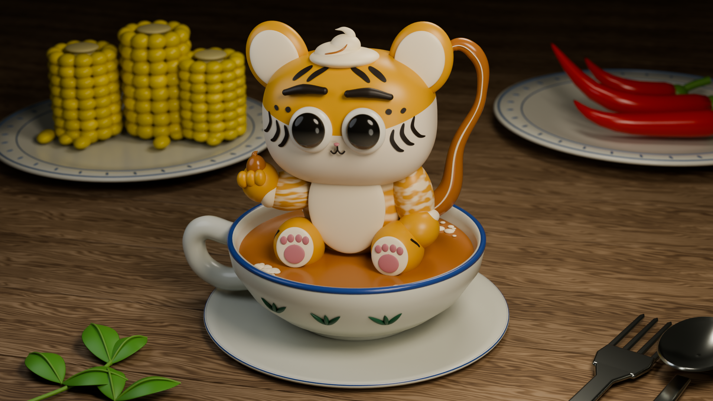

# Mani Mani Ohm

**A tiger, a cup of teh tarik, and a procedural scene.**

Creative experiment · local Blender source and rendered artifacts

## The experiment

Mani Mani Ohm brings character design and Malaysian food references into a 3D scene. The available work includes a procedural Blender builder, a style bible, animation and rendering scripts, and visual verification artifacts.

This continuation was constructed from two supplied finished films, without their original meshes or rigs. Hidden anatomy, materials, and camera settings are reconstructed estimates. The image above is an existing project render, not a new illustration produced for this profile.

## What makes it part of this lab

It uses the same loop as a software prototype: define a constraint, construct a system, inspect its output, and adjust the implementation. Here the result is visual rather than a workflow dashboard.

The code and assets demonstrate a procedural creative process. They do not by themselves prove an autonomous generative-media product, a trained character model, or a complete commercial collection.

## What was checked

The existing hero image was visually inspected. Artifact checks passed for all 145 native 1920 × 1080 PNG frames and the 5.8-second, 25-fps H.264 video, including file validity, metadata, and descriptive loop-seam measurements. The Blender scene was not reopened or rerendered during this review; those checks do not establish a fresh visual review of the full animation.

## What to inspect next

A useful process demonstration would connect a small design change to the builder script, the resulting scene, and the final frame. Keep the supplied film references and source attribution intact. Turn the existing rebuild recipe into a concise process walkthrough, document its machine-specific rendering assumptions, and explain the intentional character choices.

[Back to the lab](../README.md)
