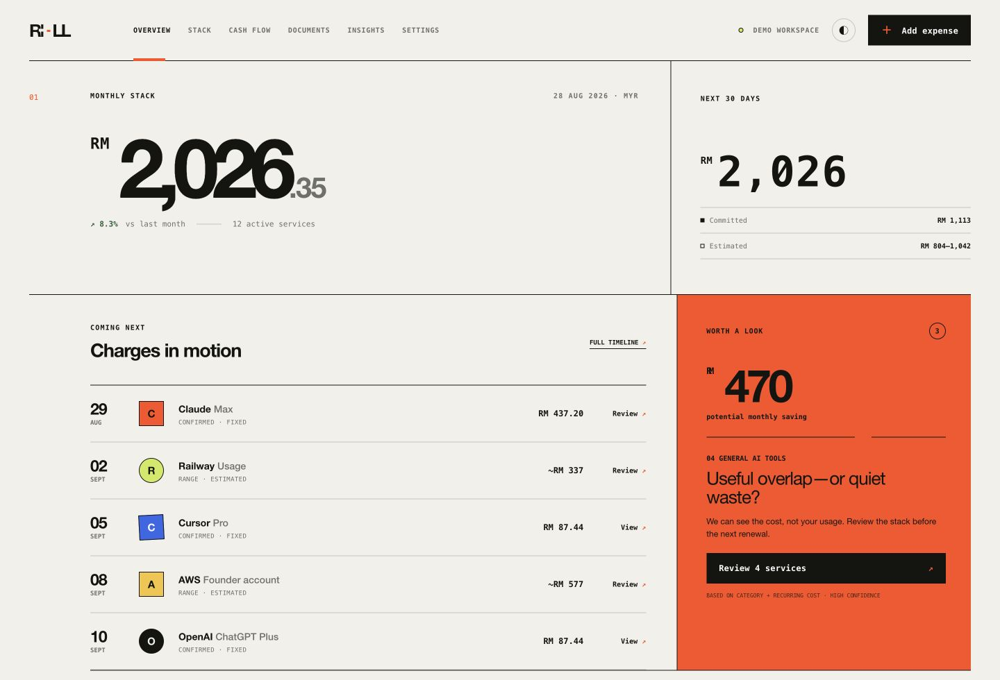

# Rill

**Know what the stack costs, what charges next, and what deserves review.**

Product prototype · fictional demo · source not published on GitHub · September 2026 snapshot

[Open the fictional product demo](https://rill-founder-spend-os.way777.chatgpt.site/demo). Its public page and demo label were verified on 13 September 2026; connected financial services were not.



The image shows the **demo workspace**. Provider connections, savings, usage, and other displayed sample information must not be interpreted as live financial evidence.

## The problem

A small founder's software stack can grow faster than their understanding of it. A useful next decision needs more than a total: renewal dates, currency, certainty, duplicate candidates, and a distinction between fixed commitments and estimates.

## What exists

Rill combines a React interface with deterministic financial logic, subscription storage routes, and a document-ingestion pipeline. The pipeline normalizes inputs, creates extraction candidates, validates them, and supports human confirmation and duplicate review.

```text
document → normalization → extraction candidate
                                      ↓
                           deterministic validation
                                      ↓
                         duplicate review + confirmation
                                      ↓
                              subscription record
```

The model's role is constrained to structured extraction. It does not receive arbitrary network, database, or write tools in that extraction step. A missing model credential has an unavailable/manual path rather than fabricated extraction.

## Why this is interesting

The product makes a distinction between a suggestion and a financial fact. Money and renewal calculations should be reproducible. An extraction should carry provenance and uncertainty. A cancellation label inside the product should not claim that an external provider cancelled anything.

## What was checked

Eighteen offline domain and ingestion tests passed in an isolated copy during review. The source also includes synthetic extraction-evaluation fixtures. No fresh live-model extraction-quality result was established by this audit.

## What is unfinished

The authenticated application still reuses parts of the demo shell. Some surfaces remain fictional or browser-local. Provider connections, alert delivery, live FX, bank feeds, and usage feeds are inactive. Upload hardening, transactional confirmation, retention/deletion verification, and stronger tenant tests remain release gates.

The demo is useful for understanding the product. It is not an invitation to upload sensitive financial documents or a claim that the product is ready for production financial use.

## The next useful experiment

Use a synthetic receipt with an ambiguous renewal date and a possible duplicate. Show the extraction candidate, the uncertainty, the correction, and the confirmed record. Measure correction rates before expanding the integration surface.

[Back to the lab](../README.md)
